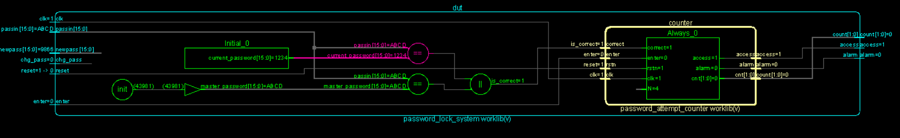
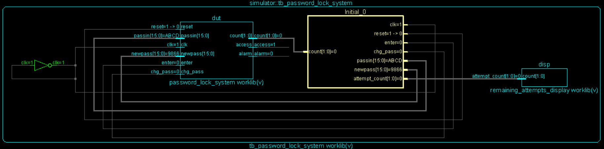

# 💻 02 Simulation

This section discusses the RTL logic verification of the **Advanced Password Locking System**. Detailed Verilog testbenches evaluate the standard, override, failure, and password-change scenarios to assure logically sound silicon logic.

## 📖 RTL Design Overview
The RTL code `design.v` specifies the behavior using Verilog. It embodies a top-level overarching architecture where synchronous and combinational paths govern access rights without complex latency.

## 📜 Description of `design.v` Module
The core implementation lies in `password_lock_system`. When an input is fetched from `passin` and validated with `enter` driven **HIGH**, the state logic processes the input. The structural partitioning utilizes independent concurrent assignments paired with synchronous reset and update logic.

- **Password Verification Logic:** A continuous assignment evaluates truth vectors. It checks `(passin == current_password)` or `(passin == master_password)`, updating `is_correct` in hardware with zero-delay combinational logic. (Master password is `16'habcd`).
- **Password Update Mechanism:** In the main logic array, upon a positive clock edge, if `chg_pass` is asserted and the current `is_correct` logic confirms the user has authenticated successfully, the hardware securely replaces `current_password` with `newpass`.

- **Wrong Attempt Counter Logic:** An entirely separate submodule `password_attempt_counter` records failure iterations. Utilizing sequential statements checking `cnt == N-2` or `cnt == N-1` (where N=4). Upon processing `enter`, incorrect inputs increment `cnt`.
- **Alarm Logic:** Driven by the aforementioned state counter. After passing the `N-2` mark directly to 3 missed checks, `alarm` latches **HIGH**. Access (`access`) permanently remains **LOW**. Standard resets `(!reset)` must reboot the lock.

## 🧪 Testbench Explanation
A comprehensive standard `tb.v` stimulates the logic, driving the clock continuously and passing known inputs. Typical verifications involve initializing the system with valid signals, attempting four consecutive invalid passwords to trigger the fail-state alarm, applying a generic reset, successfully updating the password utilizing a master override, and passing a standard access check against the new key. 

## 🔌 Simulation Results & Schematics
The waveforms log the clock edges transitioning state vectors properly. Successful inputs immediately drive `access` **HIGH**.

### Simulation Files Compilation

### RTL Schematic of the Design Under Test (DUT)

### RTL Schematic containing the Testbench Setup

### 📈 Simulation Waveform Explanation
The generated simulation diagrams illustrate the behavioral verification. The inputs line up symmetrically with setup constraints, confirming that after the `N=4` limit, the lock ceases outputting high toggles.

## 🧰 Tools Used
- **Simulation & Verification:** Cadence Xcelium
