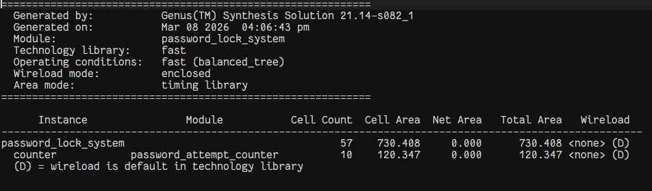
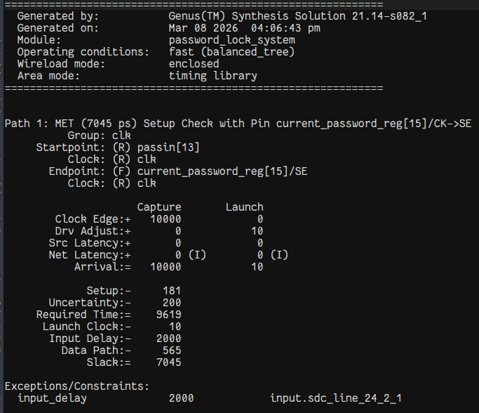
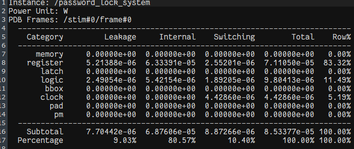
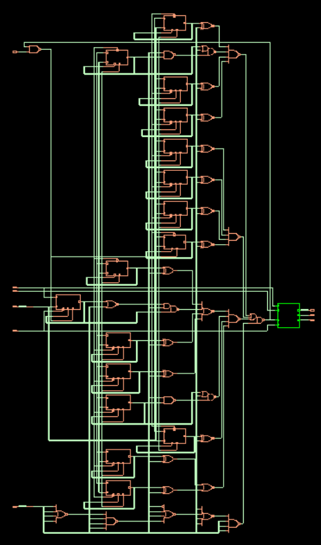

# 🛠️ 03 Synthesis

This section outlines the translation of the abstract RTL code into standard cell-based logic arrays. The logic synthesis maps combinational structures into real, delay-characterized cells required for the **Advanced Password Locking System**.

## 📖 Synthesis Overview
The target of synthesis is to elaborate the design and verify timing, area, and power metrics against predefined baseline library definitions. The logic mapping adheres to constraints guaranteeing timing closure before beginning PnR (Place and Route).

## 🔄 RTL to Gate-Level Flow
Using established standard cell libraries, the underlying tools dissect the hierarchical `password_lock_system` into low-level logical primitives (e.g., AND, OR, NOR clusters mapped to a targeted technology node like 45nm or 28nm). A comprehensive series of gate-level verifications is then checked to align with setup/hold rules.

### 📜 Constraints Used
Synthesis constraints define the environment boundaries for the design logic. The key constraints applied entail:
- Clock period definitions aligning with expected operational frequencies.
- General maximum transition time and max capacitance for output drivers.
- Setup/Hold definitions reflecting practical external environmental conditions.

## 📊 Synthesis Reports
Synthesis outputs detailed metrics regarding cell distribution, physical size, power dissipation, and critical path timing measurements.

### 📐 Area Report
Details the physical scope of combinational arrays (logic gates) versus sequential arrays (flip-flops, registers).

### 📈 Timing Report
Ascertains that critical paths meet setup time constraints, leaving positive slack and robust data consistency.

### 🔋 Power Report
Evaluates both static (leakage) and dynamic (switching) power dissipation.

## 🖧 Gate-Level Netlist Explanation
The resultant synthesized representation is formally dumped to a standard `.v` netlist (e.g., `syn_netlist.v`). It structurally defines the mapped logic gates, removing abstractions. The testbench validation operates against this netlist to verify the absence of logic-shift discrepancies post-mapping.

### 📁 Synthesis File Structures
A complete set of tools generates output `.sv`, `.rep`, and `.sdc` files defining the environment context securely compiled into the project directory.

## 🧰 Tools Used
The industry EDA toolkit employed for this synthesis conversion is **Cadence Genus**, configuring precise logic optimizations to achieve targets.
