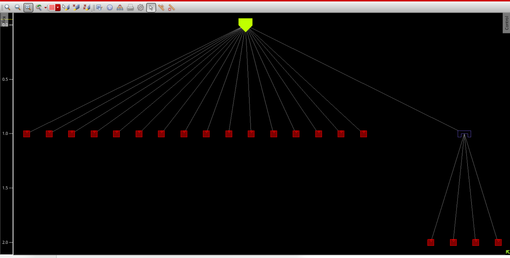
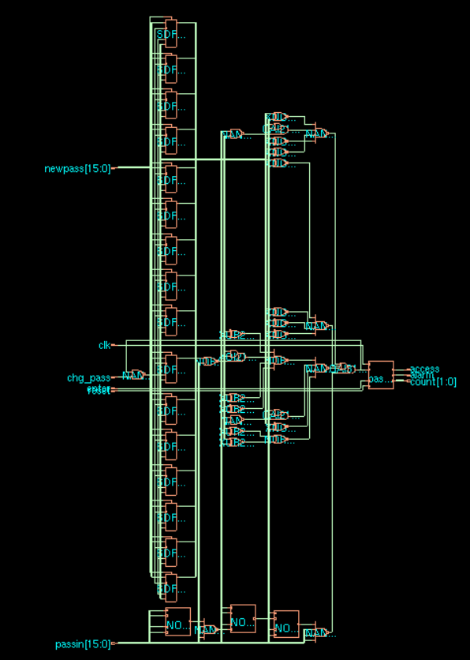
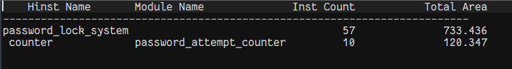
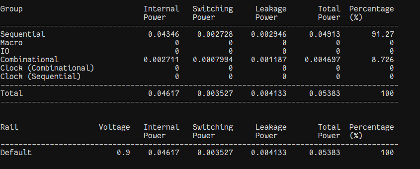
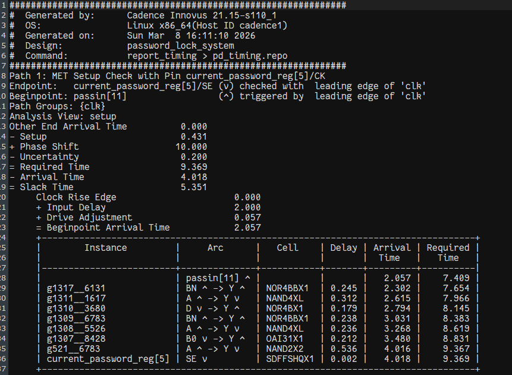
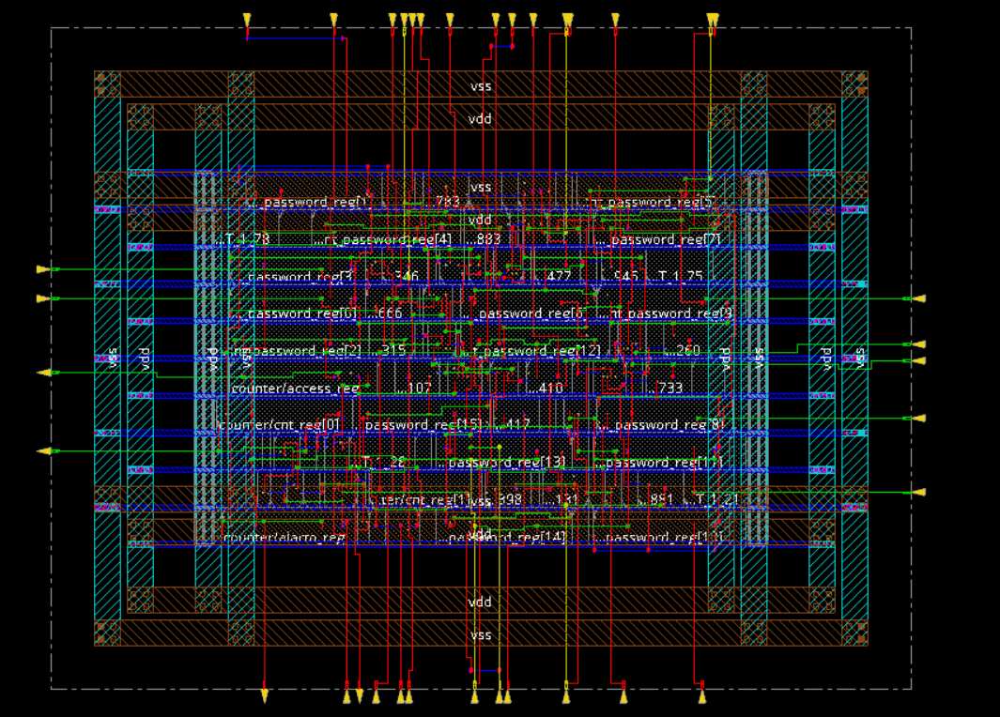

# 🏗️ 04 Physical Design

This section covers the final physical implementation of the synthesized **Advanced Password Locking System**. From an abstract logic level, the mapped gates are placed onto a specific chip floorplan, routed optimally, and finalized into a manufacturable GDSII layout.

## 📖 Physical Design Overview
The Place and Route (PnR) flow bridges logic to physical realization. It targets strict adherence to Timing Closure, DRC (Design Rule Checks), and LVS (Layout versus Schematic) requirements, guaranteeing a functional, reliable physical chip layout.

## 📐 Floorplanning
Floorplanning defines the core boundary size based on utilization constraints. It strategically places I/O pins (`reset`, `clk`, `passin`, `newpass`, `enter`, `chg_pass`, `access`, `alarm`, `count`) and shapes the standard cell rows.

## ⚡ Power Planning
A robust power grid (rails, stripes, and rings) is synthesized to distribute `VDD` and `VSS`. Power rings encapsulate the core boundary to minimize voltage drops and meet EM (Electromigration) constraints.

## 🧱 Placement
The synthesized logic cells are logically oriented to minimize wire lengths and signal delay while ensuring density stays within limits, avoiding congestion issues that disrupt subsequent routing.

## ⏱️ Clock Tree Synthesis
To manage clock skew across the sequential locking state machine logic, an optimized Clock Tree Synthesis (CTS) is run. It inserts necessary clock buffers to equalize arrival times across all clock pins (`design.v` flip-flops).

## 🔀 Routing
After ensuring CTS targets are met, data paths are physically wired using metal layers. Routing occurs in two distinct passes: Global Routing for broad paths and Detailed Routing for strict metal alignment avoiding DRC shorts/opens.

## 📈 Timing Closure
Timing engines compute parasitic RC extractions. Final static timing analysis confirms no setup/hold violations exist post-routing, generating detailed PnR reports.

### Physical Design Reports
- **Area Report:** Details physical size after routing.

- **Power Report:** Refined power estimates accounting for RC extraction.

- **Timing Report:** Final sign-off timing analysis guaranteeing stability.

## 🖨️ Final Layout
The ultimate deliverable is a functional GDSII layout stream, verified to be DRC and LVS clean, representing the mask layers to be fabricated at a foundry.

### Complete Layout Topography

### Core Chip Final Layout

## 🧰 Tools Used
- **Physical Design (PnR):** Cadence Innovus
