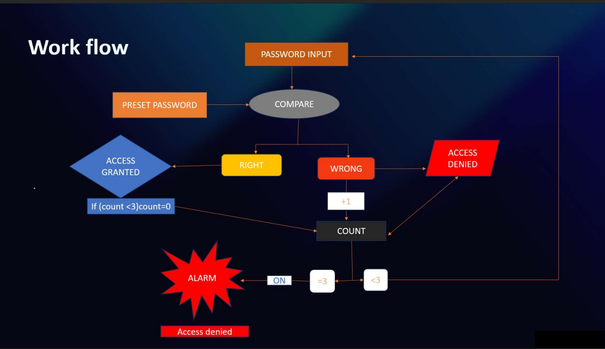

# 🔒 Advanced Password Locking System

Welcome to the **Advanced Password Locking System** repository! This project showcases a complete ASIC/VLSI Design Flow from RTL specification mapping down to final Physical Design layout.

## 📖 Project Overview
The Advanced Password Locking System is a robust, hardware-based security module. It verifies a 16-bit password input against a stored password or a system-level master password, granting access upon success, or rejecting the attempt. With built-in security constraints, the system maintains a counter for failed attempts and triggers a persistent alarm if the allowed number of attempts is exceeded.

## 🎯 Motivation
With the advent of increasingly sophisticated systems operating at the edge, dedicating hardware to critical security mechanisms is essential. This project sets out to map a fundamental security feature—a password locking mechanism with tamper prevention (alarm trigger)—into a dedicated digital hardware module, showcasing an end-to-end full custom ASIC design flow.

## ✨ Key Features
- **Password Verification:** Supports normal password authentication (16-bit) and an overriding master password (16-bit `0xABCD`).
- **Wrong Attempt Counter:** Autonomously tracks consecutive incorrect inputs.
- **Fail-Secure Alarm Trigger:** Activates an intrusion alarm after exactly 3 failed attempts, locking out further immediate tries.
- **Password Change Functionality:** Enables dynamic updating of the stored password upon successful authentication and a change-password request.
- **Reliable Access Control:** Grants access purely via synchronous validation logic.

## 🏗️ System Architecture
The top-level view comprises the `password_lock_system` module, internally instantiating the combinational password verification logic alongside a robust Sequential State Counter (`password_attempt_counter`). 

### 📐 Workflow

## 🛠️ VLSI Design Flow Used
1. **Specifications & Architecture:** Defining the structural inputs, outputs, rules, and hardware modules.
2. **RTL Design & Simulation:** Writing Verilog (`design.v` & `tb.v`) and validating logical correctness via waveforms.
3. **Logic Synthesis:** Translating RTL into optimized gate-level netlists with given standard cell libraries and checking initial timing/area/power.
4. **Physical Design (PnR):** From floorplanning and clock tree synthesis down to final signal routing and GDSII generation.

## 📂 Folder Structure Explanation
| Folder | Description |
|--------|-------------|
| **`01_SPECIFICATIONS/`** | Contains specifications, I/O definitions, timing, and security constraints. |
| **`02_SIMULATION/`** | Contains RTL Verilog code, testbenches, simulation logs, and waveform analysis. |
| **`03_SYNTHESIS/`** | Contains the gate-level netlist, synthesized schematic visualizations, and power/area/timing reports. |
| **`04_PHYSICAL_DESIGN/`** | Contains layout snapshots, CTS reports, Post-Route information, and the final extracted layout logic. |

## 💻 Simulation Overview
Simulation was conducted to thoroughly verify the logical paths and fail-secure mechanisms. RTL codes (`design.v` and testbench `tb.v`) were compiled and simulated. Key verification milestones such as authentic password matching, consecutive mismatch limits triggering the alarm, and successful password modifications were exhaustively tested. (See `02_SIMULATION` folder for full details).

## ⚙️ Synthesis Overview
The verified RTL is pushed through standard Logic Synthesis tools mapping it to an underlying standard cell library. The synthesized result ensures that the translation to primitive logic gates honors the setup and hold definitions. Details on Area, Power, and Timing, as well as the generated gate-level schematic, are available in the `03_SYNTHESIS` directory.

## 🏭 Physical Design Overview
The physical implementation bridges the synthesized netlist to manufacturable chip geometry. The flow entails precise Floorplanning, strategic Power Planning, detailed Placement, Clock Tree Synthesis (CTS) for optimal clock distribution, Routing of data nets, and reaching Timing Closure. The final stage produces the chip layout.

## 🧰 Tools Used
- **Simulation & Verification:** Cadence Xcelium
- **Logic Synthesis:** Cadence Genus
- **Physical Design (PnR):** Cadence Innovus

## 🚀 Future Improvements
- **Encryption:** Integrate AES/RSA hardware accelerators to encrypt the stored password.
- **Variable Length Passwords:** Scale the data bus sizes dynamically instead of utilizing a rigid 16-bit limit.
- **Lock-out Timer:** Incorporate a cooldown timer instead of a hard lockout when the alarm triggers.

## 👤 Author Section
*Designed and Compiled as a complete portfolio project showcasing Full-Stack VLSI Design pipeline methodologies.*
